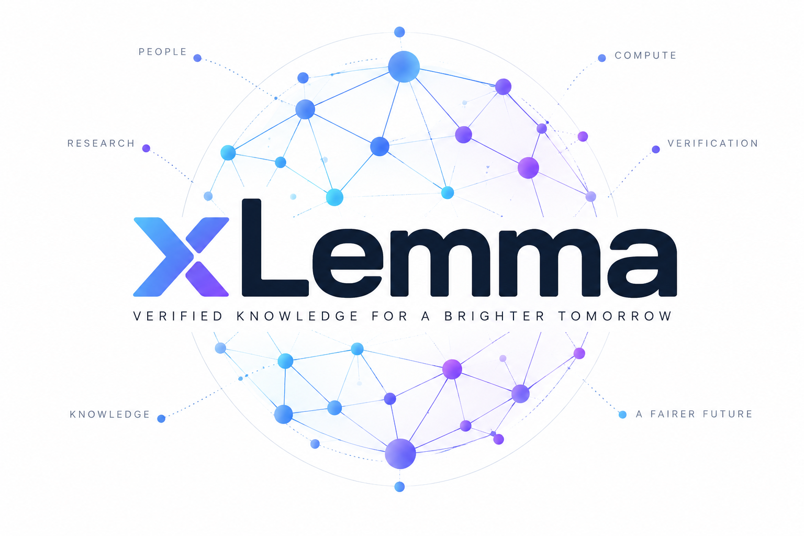

# xLemma Protocol

<p align="center">
  
</p>

**Proof-carrying infrastructure for financing, producing, independently
reproducing, attributing, licensing, and funding the reuse of research
artifacts.**

> Status: architectural reference implementation and prototype. The Rust, Lean, Solidity, payment, and cryptographic components have not been independently audited. Do not deploy with real funds until the missing production work in `ROADMAP.md` is complete.

**Navigate:** [Why xLemma](#why-xlemma) · [What xLemma is](#what-xlemma-is) ·
[XLMP/1](#xlmp1-is-the-protocol-boundary) ·
[Node network](#first-class-node-network) ·
[Researcher sovereignty](#researcher-sovereignty-and-portable-exit) ·
[PoIR](#proof-of-independent-reproduction) ·
[Economics](#research-credit-economics) · [Repository map](#repository-map) ·
[Start here](#start-here)

## Why xLemma

Powerful models can make research production abundant. They do not, by
themselves, make research trustworthy, attributable, portable, or economically
fair. xLemma supplies the missing coordination layer: every consequential step
produces an immutable object or signed receipt that another participant can
inspect and reproduce.

The protocol is built around four commitments:

1. **Evidence before authority.** Mathematical validity comes from exact,
   independently reproduced checker execution—not token voting, reputation, or
   institutional status.
2. **Researchers retain sovereignty.** Origin, attribution, artifact control,
   bounded economic participation, license choice, governance consent, and
   portable exit travel with the research object.
3. **Economic claims conserve value.** Credits and payouts trace to backing or
   settled external revenue. Dependency edges alone never manufacture debt.
4. **Every powerful dependency is replaceable.** Provers, proof assistants,
   payment systems, chains, storage networks, and model providers connect
   through adapters. None defines xLemma's research state.

### From people to durable knowledge

The opening graph summarizes the xLemma loop:

| Stage | What the protocol coordinates | Durable evidence |
|---|---|---|
| **People** | Sovereign researchers, supporters, reviewers, and accountable node operators | `ResearcherID`, credentials, contribution and rights manifests |
| **Compute** | Quoted proof search, checking, simulation, storage, and review services | `ComputeQuote`, service order, assignment, and `ComputeReceipt` |
| **Research** | Canonical claims, proofs, data, code, dependencies, and declared assumptions | `TheoryID`, `ClaimID`, `ProofID`, artifact and dependency roots |
| **Verification** | Independent reproduction, statement alignment, challenges, and quarantine | observation commits/reveals, verification receipts, PoIR certificates |
| **Knowledge** | Certified, addressable, licensed, and revalidatable research packages | immutable `LemmaCapsule`, publication record, lineage, and availability evidence |
| **A fairer future** | Researcher income, public goods, verifier payment, and future research capacity | settled `RevenueEvent`, bounded routes, backed `ResearchCredit`, and vault records |

```text
people → backed funding → compute → research artifact → independent verification
   ↑                                                        │
   └── new research capacity ← settled value ← reusable knowledge
```

The loop is intentionally conservative: a failed or divergent result still
creates useful evidence and still pays honest reproduction work, while only a
policy-sufficient result advances toward certification.

### Choose your path

| If you are a… | Begin with… | Then inspect… |
|---|---|---|
| Researcher or collective | [`docs/RESEARCHER_USER_JOURNEYS.md`](docs/RESEARCHER_USER_JOURNEYS.md) | sovereignty, capsules, funding, reuse, and correction flows |
| Node operator or verifier | [`docs/OPERATOR_RUNBOOK.md`](docs/OPERATOR_RUNBOOK.md) | credentials, advertisements, assignments, observations, bonds, and challenges |
| Protocol implementer | [`spec/018-xlmp-wire-protocol.md`](spec/018-xlmp-wire-protocol.md) | canonical messages, lifecycle rules, schemas, and adapter contracts |
| Security reviewer | [`docs/THREAT_MODEL.md`](docs/THREAT_MODEL.md) | trust boundaries, capture risks, failure modes, and production gates |
| Economist or governance designer | [`docs/GOVERNANCE_CONSTITUTION.md`](docs/GOVERNANCE_CONSTITUTION.md) | conservation laws, economic modes, rights, and chamber constraints |

### Protocol at a glance

| Plane | Native responsibility | Representative objects |
|---|---|---|
| Research graph | Identity, claims, proofs, dependencies, provenance, publication, and lineage | `ResearcherID`, `ClaimID`, `ProofID`, `LemmaCapsule`, `ContributionManifest` |
| Node network | Discovery, service markets, assignments, sortition, bonding, multidimensional reputation, and PoIR | service advertisements, orders, committee records, observations, challenges |
| Economics | Backed research credits, vault accounting, compute settlement, revenue routing, and bounded dividends | `ComputeQuote`, `ComputeReceipt`, `ResearchCredit`, `ResearchVault`, `RevenueEvent` |
| Rights and sovereignty | Attribution, license declarations, residual rights, consent, and portable exit | `RightsManifest`, license, sovereignty bundle, portability manifest |
| Adapter layer | Replaceable prover, verifier, payment, chain, transport, and storage implementations | `ResearchProver`, `VerifierAdapter`, `PaymentAdapter`, signed external-action receipts |

Across every plane, XLMP separates what is often collapsed: validity is not
authorship, authorship is not ownership, dependency is not a royalty, payment
is not certification, and popularity is not truth.

## What xLemma is

xLemma lets an individual or collective operate as a **Decentralized Researcher Node** with:

- a sovereign researcher identity;
- a fully backed, closed-loop Research Credit token, `Rᵢ`;
- a Research Vault, `Vᵢ`;
- immutable Lemma Capsules for claims, proofs, papers, code, data, and rights;
- content-derived Researcher Sovereignty Bundles and portable exit manifests;
- provider-neutral proof production, with ASTRA as the reference adapter;
- provider-neutral formal verification, with Lean as the default adapter;
- Proof of Independent Reproduction (PoIR) node certificates;
- separate human/domain statement-alignment receipts;
- pluggable payment rails, including x402, research credits, stablecoins, grants, escrow, and invoicing;
- revenue routing to contributors, bounded contractual pools, public goods, and future compute;
- job-specific service pricing and conservative impact-pool allocation;
- formal, computational, statistical, simulation, empirical, and hybrid verification profiles.

Formally:

> **xLemma is an open decentralized protocol for financing, producing,
> formally verifying, independently reproducing, attributing, publishing,
> licensing, and funding the reuse of research artifacts.**

xLemma does not create ownership of mathematical truth, guarantee royalties
from future use, or define a universal unit of scientific value.

## XLMP/1 is the protocol boundary

XLMP/1 is the canonical xLemma protocol and wire layer. It owns research
identity, immutable records, state transitions, Proof of Independent
Reproduction (PoIR), challenges, quarantine, attribution, rights, and economic
conservation. Named external technologies are replaceable adapters:

```text
                         XLMP/1
                            │
         ┌──────────────────┼──────────────────┐
         │                  │                  │
   Evidence graph       Node network       Economic graph
   claims/proofs        PoIR/challenge     credits/revenue
   provenance/rights    discovery/markets  compute/bounties
   dependencies         identity/sortition dividends
         │                  │                  │
         └──────────────────┼──────────────────┘
                            │
                 adapter / transport layer
                            │
       ┌──────────┬─────────┼─────────┬──────────┐
       ▼          ▼         ▼         ▼          ▼
   ASTRA/etc.  Lean/etc.  x402/etc. chains   IPFS/etc.
```

- ASTRA is a `ResearchProver` implementation, not xLemma and never a certifier
  of its own output.
- Lean is the default `VerifierAdapter`, not xLemma. Other formal systems can
  participate under explicit theory, canonicalization, and checker policies.
- x402 is one `PaymentAdapter` and paid HTTP transport. It never defines XLMP
  research state.
- chains provide optional ordering, settlement, and finality; they do not
  establish mathematical truth, attribution, novelty, or rights.
- storage systems preserve content-addressed artifacts and availability
  evidence; they do not establish validity.

The canonical envelope and required messages are specified in
[`spec/018-xlmp-wire-protocol.md`](spec/018-xlmp-wire-protocol.md). XLMP/1
includes `XLMP_CLAIM`, `XLMP_COMMIT`, `XLMP_COMPUTE_QUOTE`,
`XLMP_PROOF_CANDIDATE`, `XLMP_VERIFY_REQUEST`, `XLMP_OBSERVATION_COMMIT`,
`XLMP_OBSERVATION_REVEAL`, `XLMP_CERTIFICATE`, `XLMP_CHALLENGE`,
`XLMP_FINALIZE`, `XLMP_REVENUE`, `XLMP_REVALIDATE`,
`XLMP_NODE_ADVERTISE`, `XLMP_DISCOVERY_REQUEST`,
`XLMP_DISCOVERY_RESPONSE`, `XLMP_SERVICE_ORDER`, `XLMP_SERVICE_MATCH`,
`XLMP_SORTITION_REQUEST`, `XLMP_COMMITTEE`, `XLMP_REPUTATION`, `XLMP_BOND`,
`XLMP_USER_CREDENTIAL`, `XLMP_OPERATOR_CREDENTIAL`, `XLMP_NODE_CREDENTIAL`,
`XLMP_CREDENTIAL_REVOCATION`, `XLMP_SOVEREIGNTY`, `XLMP_PORTABILITY`,
`XLMP_RESIDUAL_RIGHT`, `XLMP_ECONOMIC_CONSTITUTION`,
`XLMP_ECONOMIC_COMPLIANCE`, `XLMP_VERIFICATION_PROFILE`, `XLMP_REPRODUCTION_OBSERVATION`,
`XLMP_RESEARCH_CERTIFICATE`, `XLMP_COMPUTE_COOPERATIVE`,
`XLMP_CAPTURE_DASHBOARD`, `XLMP_NODE_WORK`, `XLMP_NODE_EXPOSURE`,
`XLMP_MISCONDUCT`, `XLMP_GOVERNANCE_PROPOSAL`, and
`XLMP_CREDENTIAL_EVIDENCE`.

Its protocol lifecycle is:

```text
CLAIM → COMMIT → FORMALIZE → PROVE → REPRODUCE → CERTIFY → CHALLENGE
      → FINALIZE → PUBLISH → REUSE → REWARD → REVALIDATE
```

The flywheel is:

```text
research funding
  → prover-adapter compute
  → formal proof candidate
  → independent reproduction
  → certified lemma capsule
  → paid use / bounty / license / service
  → settled external revenue
  → researcher income + newly backed research credits
  → more research
```

## First-class node network

XLMP nodes publish signed, expiring service advertisements containing roles,
endpoints, implementations or checker families, supported theories/domains,
hardware, capacity, latency, prices, a reputation snapshot, and an eligibility
bond. Discovery requests and service orders state every constraint explicitly;
deterministic matching produces immutable service-match records bound to the
exact advertisement sequence.

Reputation is deliberately a vector rather than a scalar:

```text
formal accuracy | availability | latency | novelty calibration
challenge quality | operator independence
storage quality | integrity
```

No dimension compensates for another. Bond and reputation determine
eligibility only. Committee authority comes from policy-qualified independent
reproduction, and deterministic sortition uses committed future randomness,
unique VerifiedUserIDs, OperatorIDs, conservative OperatorClusterIDs, and
required provider/region diversity. See
[`spec/019-node-network.md`](spec/019-node-network.md).

Individual researchers and researcher compute cooperatives can own nodes. A
cooperative publishes member shares, nodes, capabilities, treasury,
governance policy, and beneficial-control evidence, but always counts as one
operator cluster on a job. Shared owners across cooperatives reduce their
independence credit.

Networks publish a capture-resistance dashboard across identity, compute,
models, verification, storage, settlement, discovery, and governance. Each
layer retains operator, beneficial-owner, provider, region, software, issuer,
frontend, and coalition measurements. Effective decentralization is the
weakest layer, not an average that can hide a captured subsystem.

## Constitutional identity and operator independence

> **No node may contribute to xLemma consensus without a valid, non-revoked
> `OperatorCredential` ultimately controlled by a verified xLemma participant.
> Multiple nodes controlled by the same participant constitute one
> operator-independence domain.**

The public identity hierarchy is pseudonymous:

```text
VerifiedUserID ── controls ──> OperatorID ── delegates ──> NodeID(s)
       │
       └── may link ──> ResearcherID
```

`ResearcherID` is a sibling research persona, not a substitute for an
accountable operator. Private legal identity and uniqueness evidence remain
with credential issuers; raw legal names, identity-document numbers,
addresses, and biometric records do not belong in public XLMP objects.

The credential chain has three independently addressable records:

| Credential | Binds | Signed by |
|---|---|---|
| `UserCredential` | Verified participant, optional researcher persona, tier, qualifications, uniqueness commitment, and issuer policy | Credential issuer |
| `OperatorCredential` | Operator, verified participant, operator cluster, authorized roles, and jurisdiction class | Participant and issuer |
| `NodeCredential` | Node key, operator, cluster, roles, and optional hardware attestation | Operator |

Credentials and revocations are append-only. A committee candidate must carry
a fresh issuer-authenticated status proof for the exact user, operator, and
node credential IDs against a specific revocation-registry root. Revoking a
user invalidates all descendant operators and nodes; revoking an operator
invalidates its nodes. Historical receipts remain readable and may be
quarantined or revalidated under policy rather than silently rewritten.

Credential tiers separate access from consensus authority:

| Tier | Purpose | Consensus authority |
|---|---|---|
| V0 observer | Read, index, and locally verify public data | None |
| V1 verified participant | Attributable participation and low-risk market activity | None |
| V2 verified operator | Accountable operator with delegated nodes | Eligible under role policy |
| V3 institutional operator | Accountable organization | Same mathematical authority as V2 |
| V4 specialized authority | Additional role-specific qualification | Only the role required by policy |

Higher tiers never make a proof more valid and never create extra votes. Gold
committees require at least three NodeIDs, three OperatorIDs, three verified
participants, two checker families, two infrastructure providers, and two
regions. The selector admits at most one committee member per
`VerifiedUserID`, `OperatorID`, and conservative `OperatorClusterID`; the
strictest collision rule wins. Running more machines or rotating keys never
creates more independence.

Beneficial-control detection is imperfect. `OperatorClusterID` is therefore a
conservative policy judgment backed by evidence and challenge procedures, not
a claim of mathematical certainty. Production issuer and cluster policies must
publish confidence, limitations, and conflicts, and must avoid dependence on a
single credential issuer.

The reference implementation includes typed credential IDs, canonical XLMP
credential and revocation messages, an append-only registry behind a required
cryptographic proof-verifier adapter, exact credential-chain commitments,
freshness and tier checks, revocation-aware eligibility, and identity-bound
assignment, observation, commit-reveal, and PoIR records. Production networks
must still supply and audit their issuer trust policy, key resolution,
uniqueness process, cryptographic verifier, and decentralized revocation-root
publication. See
[`spec/020-identity-credentials.md`](spec/020-identity-credentials.md).

## The central separation

xLemma never treats token ownership or node popularity as mathematical truth.

```text
Lean validity
  ≠ authorship
  ≠ legal ownership
  ≠ token ownership
  ≠ license rights
  ≠ novelty
  ≠ significance
  ≠ statement alignment
  ≠ LaTeX interpretation
  ≠ payment settlement
```

Under a pinned environment, formal validity is deterministic. Nodes independently reproduce and sign observations. The network reaches consensus over **evidence sufficiency and state transitions**, not over truth by majority vote.

Lean certification and statement alignment are separate. A
`StatementAlignmentReceipt` binds the exact `ClaimID` to hashes of the informal
claim and LaTeX presentation, disclosed assumptions, reviewed definitions,
domain reviewers, limitations, and signatures. A formally valid but vacuous,
weakened, or misleadingly presented statement can therefore remain
`misaligned` or `inconclusive`; no interface should combine these statuses into
one badge.

## Researcher-first object model

```text
DecentralizedResearcherNode
├── ResearcherID
├── ResearchCredit Rᵢ
├── ResearchVault Vᵢ
├── ContributionIdentity
├── ReputationRecord
├── LemmaCapsules[]
├── ComputeReservations[]
├── RevenueAccounts[]
├── Licenses[]
└── GovernancePolicy

LemmaCapsule
├── LemmaID
├── TheoryID
├── ClaimID
├── ProofID
├── ArtifactRoot
├── LeanArtifact
├── LaTeXPresentation
├── OriginCertificate
├── ContributionManifest
├── MachineContributionRecord
├── DependencyRoot
├── VerificationReceipts
├── NoveltyReceipts
├── StatementAlignmentReceipts
├── RightsManifest
├── ResearcherSovereigntyBundle
├── ResearcherResidualRight
├── PortabilityManifest
├── EconomicMode
├── RevenueRoute
├── ComputeHistory
└── VersionLineage
```

One researcher has one primary research-credit economy and many immutable lemma capsules. xLemma deliberately avoids launching one freely tradable token for every lemma.

## Five conservation laws

| Law | Protocol consequence |
|---|---|
| Truth | Stake, votes, reputation, and tokens never establish formal validity. |
| Value | Withdrawable rewards trace to settled value from an external payer. |
| Rights | Registration records evidence; it cannot manufacture legal rights or ownership of mathematics. |
| Independence | Many machines under common beneficial control count as one independence domain. |
| Causality | Formal dependency proves use, not commercial causation or debt. |

The last rule creates two graphs. The evidence graph records
`FORMALLY_DEPENDS_ON`; the economic graph records explicitly agreed obligations.
The invariant is `FORMALLY_DEPENDS_ON != OWES_PAYMENT_TO`. An upstream payment
requires settled revenue, an active economic policy, an eligible economic edge,
a bounded pool, a declared minimum-payout floor with explicit remainder, and
non-recursive treatment of that revenue event.

## Researcher sovereignty and portable exit

A `ResearcherSovereigntyBundle` binds seven protections to the exact research
object: origin, attribution, artifact control, economic participation, license
control, governance consent, and portability/exit. Origin, attribution, and
exit cannot be transferred or revoked by protocol governance. Challenges and
corrections create append-only superseding records; they never erase history.

A `ResearcherResidualRight` is narrower than ownership. It can participate only
in named, qualifying, settled xLemma revenue under an explicit policy. Every
right is nonexclusive, bounded per event and over its lifetime, depth-limited,
nonrecursive, equivalent-claim clustered, and unable to block downstream use
or publication. Assignment requires bilateral signed-agreement evidence; a
token transfer cannot assign it.

Portable exit is a protocol property, not a frontend promise. A signed,
content-derived portability manifest links identity credentials, artifacts,
contributions, verification receipts, economic policies, settlement
commitments, event-log checkpoints, and at least two independent storage
locations for each artifact. An independent client can reconstruct the
researcher state if a company, indexer, chain adapter, or storage provider
disappears. See
[`spec/022-researcher-sovereignty.md`](spec/022-researcher-sovereignty.md).
The on-chain `ResearchCommitmentRegistry` stores only the corresponding
researcher, claim, artifact, policy, committee, rights, contributor-split, and
supersession roots; research contents and validity remain off-chain.

## Proof of Independent Reproduction

A node does not merely vote `PASS`. It signs:

```text
I independently executed checker implementation X,
against artifact Y,
inside environment Z,
under policy P,
and observed result R.
```

A Gold formal certificate requires a generalized role quorum such as:

```text
2 independent official Lean-kernel executions
AND 1 independently implemented checker execution
AND identical ClaimID, ProofID, ArtifactRoot and DependencyRoot
AND identical permitted axiom inventory
AND distinct operator clusters
AND distinct verified participants and OperatorIDs
AND no unresolved challenge
```

If one required checker family disagrees, the result is `DIVERGENT` and moves to `QUARANTINED`. It is never accepted by a 2-to-1 vote.

## Research-credit economics

`Rᵢ` is initially a **fully backed research service credit**, not a speculative profit token.

```text
1,000 USDC deposited into Vᵢ
  → at most 1,000 Rᵢ minted

40 Rᵢ spent on verification
  → 40 Rᵢ burned
  → up to 40 USDC released to independent service nodes
```

Credits can be minted only from independently valued backing, settled external revenue, grants, bounties, or conservatively valued prepaid compute. They cannot be minted against an unverified lemma, expected profits, or their own secondary-market price.

A researcher may auto-compound a chosen fraction of settled contributor revenue into new backed credits:

```text
creator revenue = 650 USDC
auto-compound rate = 60%

390 USDC retained in vault + 390 Rᵢ minted
260 USDC paid to researcher
```

## Rights and economic modes

Each capsule distinguishes nontransferable origin/provenance, rights in actual
artifacts or contracts, and economic participation in a defined revenue source.
It selects one mode:

| Mode | Default economic behavior |
|---|---|
| Commons | No mandatory per-use protocol fee; eligible for grants, donations, and separately authorized impact pools. |
| Reciprocal | Qualifying monetized xLemma descendants route one bounded, nonrecursive upstream pool without a downstream veto. |
| Commercial Artifact | Controlled artifacts/services may use explicit, bounded license and upstream-pool terms. The public claim stays open. |
| Sponsored Challenge | Sponsor declares and funds acceptance, allocation, rights, deadline, and dispute terms before work. |

Economic terms identify the payer, revenue source, calculation base, exclusions,
duration, share, cap, transfer rules, policy root, and dispute process. Token
ownership never substitutes for those terms. Commons is the default
configuration; its mandatory dependency pool is zero.

## Verification profiles beyond formal proofs

Lean-backed `FORMAL` verification is the initial/default profile. XLMP also
defines `COMPUTATIONAL`, `STATISTICAL`, `SIMULATION`, `EMPIRICAL`, and `HYBRID`
profiles with evidence appropriate to each class. Every profile names its
required artifacts and verifier implementations, requires multiple independent
operator domains, and retains a challenge window. These profiles extend the
research object without making any model, proof assistant, container runtime,
statistics package, or laboratory the protocol authority.

## Job-specific service curve

xLemma tracks service-specific forward curves:

- `Fᵖʳᵒᵛᵉʳ(d,T)` — provider-neutral model-assisted proof production;
- `Fᴸᵉᵃⁿ(T)` — build and deterministic verification;
- `Fʳᵉᵛⁱᵉʷ(d,T)` — novelty and expert review;
- `Fˢᵗᵒʳᵃᵍᵉ(T)` — replicated proof availability.

The quality-adjusted certification cost (`QAC`) for a specific job is:

```text
QAC(n,j) = expected total cost for route n on job j
           / protocol-estimated probability of Gold certification by deadline
```

The units remain concrete and job-specific: reasoning tokens, proof-search
attempts, Lean build seconds, checker executions, review hours, and storage
byte-months. Providers publish price and capacity, but provider-advertised
success probabilities do not control routing; signed, expiring protocol
calibration records do. Basis-point probabilities, upward rounding, checked
integer arithmetic, and stable offer-ID tie-breaking keep money quotes
deterministic. Forward offers begin as reserved service capacity, not tradeable
financial derivatives.

Compute savings are one uncertain impact signal. They may allocate an explicit,
capped Research Impact Pool only when a settled economic policy authorizes the
edge; they are not an invoice automatically created by the proof dependency
graph.

## ASTRA and Lean adapters

ASTRA is a pluggable `ResearchProver` adapter. It may:

- formalize prose and LaTeX into candidate Lean statements;
- decompose goals;
- search for proof strategies;
- generate and repair Lean code;
- select existing lemmas;
- explain verified results in LaTeX;
- produce signed compute and generation receipts.

ASTRA does not certify itself. Lean is the first-class/default verifier adapter. Final formal assurance comes from pinned builds, trusted challenge matching, axiom inspection, the official kernel, independently implemented checkers, sandboxing, and open challenge periods. Computational, statistical, simulation, empirical, and hybrid jobs use the parallel `ReproductionAdapter`, content-derived observations, and multi-operator research certificates. XLMP remains prover-neutral so another formal system or reproduction backend can implement the relevant verifier contract without forking the research protocol.

The model name is configuration-driven through `OPENAI_MODEL`; the default in this snapshot is `gpt-6-astra`.

## x402 payment adapter

x402 is one optional payment and paid-HTTP adapter. xLemma maps compatible research services onto these x402 schemes:

| Service | Scheme |
|---|---|
| Fixed basic Lean check | `exact` |
| Variable research-prover search | `upto` |
| Metered repair session | `upto` |
| Repeated proof-state calls | `batch-settlement` |
| Certified artifact download | `exact` |
| Continuous research-agent session | `batch-settlement` |

The payment facilitator validates and settles payment payloads. It is intentionally outside research consensus. `PaymentReceipt` and `VerificationReceipt` remain separate, though both bind the same immutable job and artifact identifiers.

## Launch profile

The first credible deployment is intentionally narrower than a universal
research market: a sponsor-backed marketplace for ASTRA-assisted Lean
formalization and independently reproduced certification in one domain with
identifiable buyers. Cryptographic protocols, smart-contract properties,
verified algorithms, or selected optimization results are suitable starting
profiles. Expansion follows repeat external demand and measured completion—not
token issuance.

Per-lemma speculative tokens, researcher profit tokens, universal mandatory
royalties, universal research-value units, tradeable compute futures, and
token-weighted research governance are outside the core launch.

## Repository map

```text
crates/
  xlemma-core/           IDs, trust policies, credentials, research objects, node-market records, receipts and state types
  xlemma-xlmp/           XLMP/1 envelopes, messages, lifecycle and adapter traits
  xlemma-crypto/         domain-separated envelopes, signatures and replay protection
  xlemma-consensus/      PoIR, auditable sortition, quorums, commit-reveal and novelty aggregation
  xlemma-node/           credential registry, discovery/order book, matching, assignments and receipt workflow
  xlemma-economics/      backed credits, vault conservation, revenue and dividends
  xlemma-compute-curve/  service offers, forward curves and proof-cost quotes
  xlemma-astra/          configurable OpenAI Responses API adapter and proof prompts
  xlemma-lean/           sandbox/checker command boundaries and receipt generation
  xlemma-x402/           optional HTTP 402 payment adapter and XLMP binding
  xlemma-storage/        content-addressed bundle manifests and availability receipts
  xlemma-api/            HTTP reference server
  xlemma-cli/            command-line reference client

contracts/               unaudited Solidity reference contracts
lean/                    Lean tag attribute, export marker and example
latex/                   xlemma.sty and example document
schemas/                 JSON Schema definitions for protocol objects
spec/                    normative protocol specifications
docs/                    integrated design, diagrams, economics, governance, operations, testing and threats
reports/                 machine-readable conformance and simulation evidence
openapi/                  REST API contract
config/                   default policy configuration
examples/no-arbitrage/    end-to-end illustrative lemma package
examples/node-network/    advertisement, reputation, bond and XLMP identity vectors
deploy/                   local container deployment templates
scripts/                  validation, simulation and archiving tools
```

## Start here

1. Read `spec/018-xlmp-wire-protocol.md` for the canonical protocol and adapter boundary.
2. Read `spec/020-identity-credentials.md` for verified-participant, operator, node, privacy, and revocation rules.
3. Read `spec/023-trust-policy-registry.md` for fail-closed axiom, checker-family, toolchain, and dependency-lock policy.
4. Read `docs/FULL_DESIGN.md` for the complete integrated architecture.
5. Read `docs/ARCHITECTURE_DIAGRAMS.md` for system, trust-plane, lifecycle, economic, and deployment diagrams.
6. Read `docs/TRACEABILITY_MATRIX.md` to locate every requested concept.
7. Read `docs/RESEARCHER_USER_JOURNEYS.md` for researcher, supporter, node, bounty, reuse, and correction workflows.
8. Read `spec/000-overview.md` and `spec/003-poir-consensus.md` before modifying consensus.
9. Review `docs/THREAT_MODEL.md`, `docs/GOVERNANCE_CONSTITUTION.md`, and `docs/LEGAL_BOUNDARIES.md` before deployment.
10. Use `docs/OPERATOR_RUNBOOK.md`, `docs/TESTING_STRATEGY.md`, and `docs/PRODUCTION_CHECKLIST.md` as implementation gates.
11. Run `python3 scripts/validate_repo.py` to validate schemas, OpenAPI references, invariants, the source manifest, and repository completeness.
12. Verify every source digest with `sha256sum -c MANIFEST.sha256`.
13. Read `docs/VALIDATION_REPORT.md` for checks executed in this source snapshot and explicit limitations.
14. Read `docs/USE_CASE_SIMULATION_REPORT.md` for executable coverage of all eleven documented participant journeys.

> **Dependency-lock note:** `Cargo.lock` is committed for reproducible reference builds. Contract dependency locks still require review before a production release.

## Local commands

```bash
cp .env.example .env
python3 scripts/validate_repo.py
python3 scripts/simulate_economics.py
python3 scripts/simulate_use_cases.py
sha256sum -c MANIFEST.sha256

# Requires Rust 1.82+
cargo test --workspace
cargo run -p xlemma-api
cargo run -p xlemma-cli -- --help

# Reproduce canonical identity vectors
cargo run -p xlemma-cli -- derive-id user-credential examples/node-network/user-credential.json
cargo run -p xlemma-cli -- credential-chain-root examples/node-network/credential-chain.json
cargo run -p xlemma-cli -- evaluate-reproduction \
  examples/no-arbitrage/computational-verification-profile.json \
  examples/no-arbitrage/computational-verification-job.json \
  examples/no-arbitrage/computational-observations.json
cargo run -p xlemma-cli -- verify-portability \
  examples/no-arbitrage/portability-manifest.json
cargo run -p xlemma-cli -- verify-economic-compliance \
  examples/no-arbitrage/economic-constitution.json \
  examples/no-arbitrage/economic-compliance-certificate.json
cargo run -p xlemma-cli -- verify-trust \
  examples/no-arbitrage/trust-policy-registry.json \
  examples/no-arbitrage/theory.json \
  examples/no-arbitrage/proof.json \
  examples/no-arbitrage/proof-trust-evidence.json
cargo run -p xlemma-cli -- pack \
  examples/deterministic-bundle \
  examples/deterministic-bundle/inputs.json \
  --lean-toolchain leanprover/lean4:v4.33.1 \
  --dependency-lock-hash blake3:aaaaaaaaaaaaaaaaaaaaaaaaaaaaaaaaaaaaaaaaaaaaaaaaaaaaaaaaaaaaaaaa \
  --source-commit vector-1 \
  --build-image-digest sha256:bbbbbbbbbbbbbbbbbbbbbbbbbbbbbbbbbbbbbbbbbbbbbbbbbbbbbbbbbbbbbbbb \
  --created-at 2026-09-04T12:00:00Z
```

`xlemma-xlmp::encode_xlmp_frame` and `decode_xlmp_frame` provide the canonical
one-envelope binary framing used by non-HTTP stream adapters. The frame is a
four-byte big-endian length followed by RFC 8785 JSON; decoding preserves the
same MessageID as HTTP ingress and rejects trailing, truncated, oversized, or
non-canonical payloads.

Before starting the API, replace every security placeholder in `.env`.
`XLEMMA_API_AUTH_TOKEN` must contain at least 32 random bytes;
`XLEMMA_TRUSTED_SIGNERS` authorizes baseline `ed25519:<base64url-public-key>`
identities, and `XLEMMA_TRUSTED_NODE_SIGNERS` is the JSON NodeID-to-signer map.
`XLEMMA_EVENT_LOG_PATH` must identify persistent local storage for the
single-writer, hash-chained API event journal. Every accepted XLMP message and
verification-job mutation is fsynced before acknowledgement, and startup fails
closed on a broken hash chain, duplicate record, or invalid job update.
Only `/health` is unauthenticated. Observation submission requires a signed
XLMP commit, a cryptographically signed reveal, and an exact match to the job's
committed checker roster. Distinct NodeIDs must use distinct trusted signing
keys, and authenticated API inputs reject unknown or non-canonical XLMP fields.
The journal provides durable restart recovery, but it is not a replicated HA
database; run one writer per journal and include it in encrypted backups.

Lean and Solidity toolchains are optional for the structural validator and required for their respective modules.

## Non-negotiable invariants

1. Researchers cannot pay nodes with unbacked self-minted value.
2. ASTRA may produce proofs but cannot certify its own output.
3. Verifiers are paid for reproducible execution, not agreement or a passing verdict.
4. Required checker disagreement causes divergence and quarantine.
5. Researchers cannot independently finalize their own claims.
6. Realized token appreciation is not research revenue.
7. Profit distributions originate only from settled external revenue after costs and reserves.
8. Only final proof dependencies qualify for dependency rewards.
9. Formal claim changes create new `ClaimID`s.
10. Corrections, revocations, dissent, and supersession remain append-only.
11. Payments, formal validity, novelty, rights, and availability have separate receipts.
12. Token ownership cannot rewrite authorship or Lean validity.
13. A verified Lean theorem may still be trivial, previously known, misleadingly described, or commercially valueless.
14. Rights manifests cannot create intellectual-property rights the contributor never owned.
15. Quorum requirements measure distinct verified participants, operators, conservative control clusters, and implementations—not public-key count.
16. A node cannot enter consensus without a valid V2-or-higher credential chain and a fresh non-revocation proof.
17. Credentials qualify accountable participants; they never certify proofs or override exact checker evidence.
18. Public protocol identity remains pseudonymous; private legal and uniqueness evidence remains outside public XLMP objects.

## Sources and design basis

The dated source register is in `docs/SOURCES.md`; prior-art positioning is in `docs/PRIOR_ART_AND_DIFFERENTIATION.md`. Key foundations include official OpenAI Responses API documentation, official x402 V2 documentation, the Lean proof-validation guide, ERC-1155 and ERC-4626 specifications, RFC 8785, EIP-712, content-addressed storage literature, generalized Byzantine quorum research, and cryptographic sortition research.
