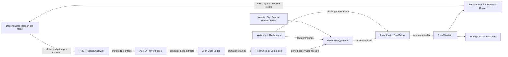
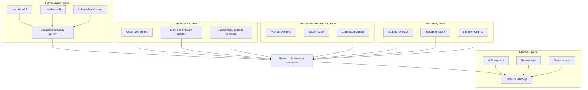
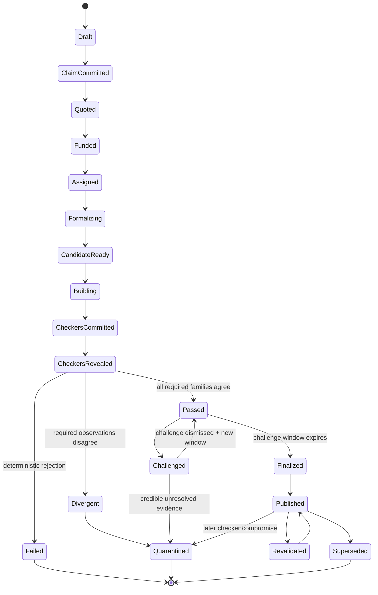
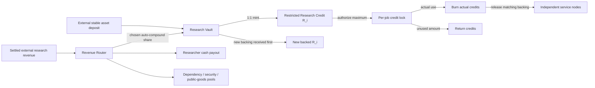
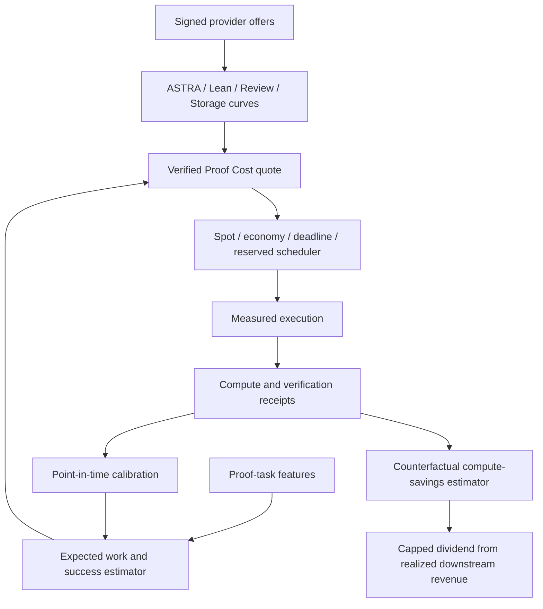
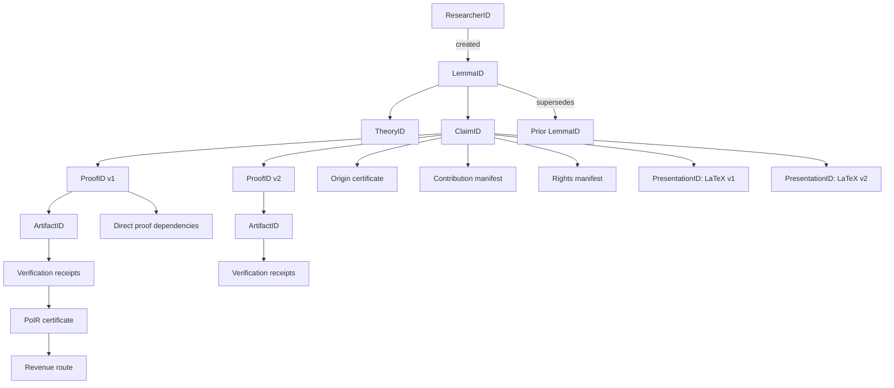
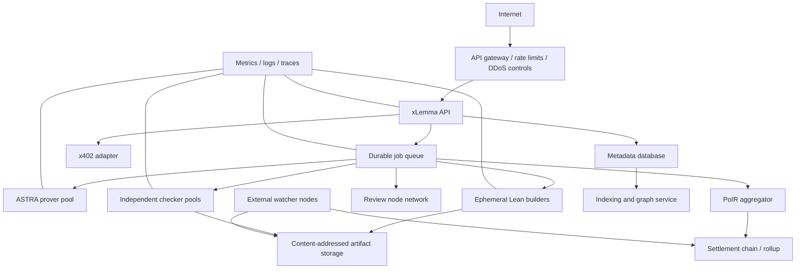
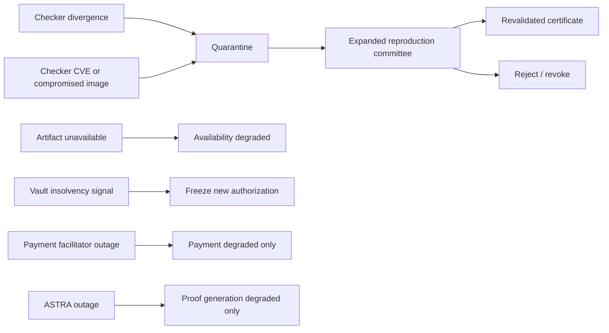

# Architecture diagrams

These diagrams are normative illustrations of the trust boundaries described in the numbered specifications. They are written in Mermaid so they render in GitHub-compatible Markdown viewers.

## 1. System context



The base chain orders certificates and economic state. It does not execute a social vote over theorem validity.

## 2. Trust planes



Each plane has a different aggregation rule. Formal validity requires deterministic equality across required checker families. Novelty uses evidence-weighted review. Economics uses ledger finality. These outputs must remain separately inspectable.

## 3. Proof lifecycle



## 4. Independent reproduction sequence

```mermaid
sequenceDiagram
    participant Researcher
    participant Router
    participant Astra as ASTRA prover
    participant Builder as Lean builder
    participant K1 as Kernel node A
    participant K2 as Kernel node B
    participant IC as Independent checker
    participant Agg as PoIR aggregator
    participant Chain

    Researcher->>Router: Commit ClaimID + ArtifactRoot + budget
    Router-->>Researcher: x402 quote / authorization requirements
    Researcher->>Router: Backed R_i authorization
    Router->>Astra: Formalize/search/repair task
    Astra-->>Router: Candidate + generation receipt
    Router->>Builder: Reproducible build request
    Builder-->>Router: Pinned artifact bundle
    par Independent execution
      Router->>K1: Verify artifact
      Router->>K2: Verify artifact
      Router->>IC: Verify artifact
    end
    K1-->>Agg: Commitment
    K2-->>Agg: Commitment
    IC-->>Agg: Commitment
    Agg-->>K1: Reveal phase open
    Agg-->>K2: Reveal phase open
    Agg-->>IC: Reveal phase open
    K1-->>Agg: Observation receipt + salt
    K2-->>Agg: Observation receipt + salt
    IC-->>Agg: Observation receipt + salt
    alt required roots and verdicts agree
      Agg->>Chain: Submit PoIR certificate
      Chain-->>Researcher: Final after challenge window
    else required family diverges
      Agg->>Chain: Submit divergence evidence
      Chain-->>Researcher: Quarantined; no revenue activation
    end
```

## 5. Research-credit conservation



The required conservation invariant is:

\[
\operatorname{backing}(V_i) \geq \operatorname{totalSupply}(R_i)
\]

No claim, token price, expected royalty, or unverified future profit counts as backing.

## 6. Compute-curve loop



## 7. Research object graph



Formal and presentation identities are separate. Editing exposition does not silently change the formal claim; changing the formal claim creates a new `ClaimID`.

## 8. Deployment topology



Production checker jobs must run in no-network, resource-constrained, ephemeral sandboxes. A proof artifact may be public, encrypted, or access-controlled, but its certificate must bind the exact content commitment.

## 9. Failure containment



Failures are compartmentalized. A payment outage cannot change formal status, and a model outage cannot invalidate an already verified proof.
