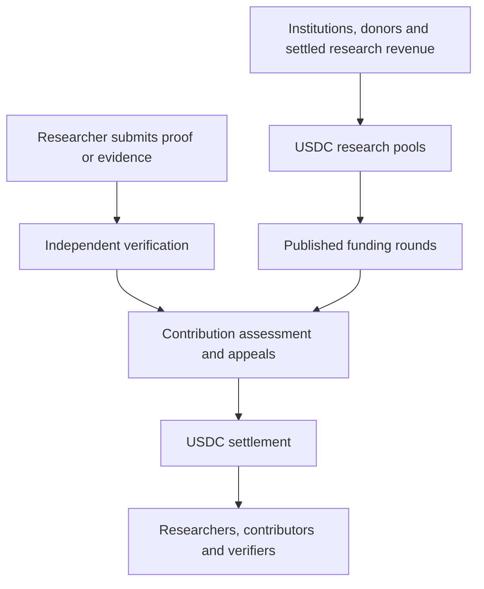

# Programmable USDC research infrastructure

Status: accepted implementation direction, 2026-09-09. The repository has a
funded discovery reference service and local EVM tests. The wallet, Paymaster,
public testnet journey and cross-chain funding integrations below are planned.
This plan does not activate a live mining network or change published round rules.

> Explore freely. Publish reproducible evidence. Earn USDC from transparently
> funded research pools.

“Mining the fabric of the universe” expresses the mission: turn computation and
research effort into reusable mathematical and physical understanding. Researchers
choose their questions; institutions and other funders finance that freedom;
independent verification establishes what the evidence supports. Every reward
comes from USDC already deposited into escrow. A proof does not create new USDC.

## Funding and research flow



Pools separate foundational research, discovery, formalization, proof improvement,
replication, tools and negative results. Preserve a protected foundational budget
and an unrestricted route for work without a buyer, bounty or institutional
affiliation. Institutions may publish broader or narrower funding mandates with
disclosed restrictions, fees and conflicts; their funding does not confer authority
to certify a result. Contributors retain the rights recorded in their manifests.

Before opening, each round fixes its funded category budgets, supported evidence
profiles, calibration, contribution grouping, award limits, contributor splits,
capacity, service fees, appeal reserves and deadlines. Only confirmed deposits
become spending capacity. Sponsorship and operations have explicit budgets.

## USDC throughout the researcher experience

The initial integration target is **native USDC on Base**, rehearsed first on
**Base Sepolia**, with an ERC-4337 smart account and Circle Paymaster. Researchers
should see funding, quotes, transaction costs, rewards and balances in USDC.
Circle documents native USDC on Base and Paymaster support for ERC-4337 accounts
on Base. The chain still uses its native gas asset underneath the wallet's USDC
fee payment. Pin the exact chain, official token address, EntryPoint version and
Paymaster deployment in the reviewed network configuration; six decimals alone
do not establish token authenticity. [USDC contract addresses](https://developers.circle.com/stablecoins/usdc-contract-addresses),
[Paymaster documentation](https://developers.circle.com/paymaster).

Start with researcher-controlled signing and explicit consent. Any delegated
automation needs limited contract/method permissions, amount caps, expiry,
revocation and replay protection. Wallet and payment-provider adapters should
preserve portable protocol identities and receipts.

Paying gas with USDC still requires a funded balance. A separate, bounded
sponsorship path should let eligible researchers submit and appeal without an
initial balance. Its eligibility, request limits and fees must be disclosed and
tested against abuse; enabling Circle Paymaster alone does not supply this fund.
Show network/provider fees before authorization and reserve maximum authorized
costs without treating them as settled expenditure.

## Evidence, contribution and allocation

Verified knowledge and reward eligibility remain separate decisions. Formal
claims require exact checker reproduction of the declared artifact, environment
and axiom policy. Physics measurements require qualified empirical profiles,
uncertainty and independent replication. A derivation or simulation establishes
only its declared mathematical or computational claim.

Contribution assessment records the additional knowledge, formalization,
improvement or independently useful work under published criteria. Renaming,
duplicate statements, artificial splitting and identity rotation cannot enlarge
one contribution group's total weight. Semantic grouping and beneficial-control
assessment remain contestable judgments requiring qualified review and appeals.

A conceptual allocation within each category is:

```text
distributable budget = settled category funding
                       - existing commitments
                       - operating, verification and appeal reserves

group reward = distributable budget * group weight / total eligible group weight
```

Use nonnegative integer USDC minor units, published award caps and deterministic
rounding, then apply consented contributor splits. No eligible groups means no
solver allocation. Rounding dust and unused funds follow published rules; the
current escrow refunds unused funds by category, so any future carryover must be
explicitly authorized and reconciled. This overview does not replace the exact
allocation and cap semantics in [XLIP-024](../spec/024-open-research-mining.md).

Difficulty and reference cost can influence calibrated, bounded weights with
published benchmarks, uncertainty and appeal rights. Report tokens, wall time,
compute and measured costs separately. More expenditure, a longer proof or more
submissions never automatically earns a larger award. Verification and review
reserves pay completed work on agreed terms regardless of PASS, FAIL or an
inconclusive result.

## Settlement and existing implementation

An award can settle only against the exact final certificate, approved allocation,
resolved timely appeals, required delays and available funding. Independent nodes
check the evidence offchain; qualified relays publish its status. The contracts
enforce certificate bindings and payment conditions. They do not execute Lean or
establish experimental truth through approval votes. Divergence and dissent must
reach the quarantine/hold path before execution.

| Component | Current reference | Integration still required |
|---|---|---|
| Signed research lifecycle | [Discovery service](DISCOVERY_SERVICE.md): rounds, consents, assessment, appeals and receipts | Qualified independent operators, production keys and monitoring |
| Funded USDC settlement | [DiscoveryRoundEscrow](../contracts/src/DiscoveryRoundEscrow.sol): category caps, approved plans, exact transfers, holds and refunds | Reviewed Base configuration, deployment and actual funding |
| Evidence publication | [DiscoveryEvidenceRegistry](../contracts/src/DiscoveryEvidenceRegistry.sol): exact-object finality and quarantine | Independent relay qualification and timely dissent propagation |
| Researcher payments | Local EVM integration with mock USDC and an explicit checker test double | Smart accounts, Paymaster, sponsorship and the public testnet journey |
| Cross-chain funding | Planned | CCTP adapter, destination observation and reconciliation |

## Delivery milestones and acceptance

1. **Specify the wallet boundary.** Publish pinned Base Sepolia configuration,
   signer/permission rules, fee and sponsorship budgets, receipt fields and
   reference vectors. Map records to existing XLMP messages before adding schemas.
2. **Build one complete testnet journey.** Exercise wallet creation/access, pool
   funding, submission, verification, assessment, appeal, payout and a portable
   settlement receipt. Testnet funds have no real monetary value; disclose any
   checker doubles and author-operated roles. This does not close independent
   verification or researcher-access gates.
3. **Exercise payment failures.** Cover wrong chain/token/EntryPoint, unauthorized
   or replayed operations, expired/revoked delegation, exhausted sponsorship,
   changed fees, failed token transfers, duplicate claims, RPC failure/reorg,
   dissent arriving before payout, process restart and settlement reconciliation.
   Preserve exact accounting and fail closed without rewriting history.
4. **Qualify for real funds.** Complete independent checker/operator qualification,
   external security review, access and appeal trials, and production recovery.
   Publish reviewed policies and launch limits before a bounded mainnet pilot.
5. **Add cross-chain funding after the single-chain journey works.** CCTP moves
   native USDC through burn-and-mint transfers with Circle's attestation service.
   Count destination escrow deposits only after confirmed receipt observation;
   source burns and pending attestations are not spendable funding. Persist
   transfer state and reconcile retries, delays and failures. [CCTP technical guide](https://developers.circle.com/cctp/references/technical-guide).

This work proceeds alongside the [physics reproduction](OSCILLATOR_REPRODUCTION.md)
and [research compounding pilot](RESEARCH_COMPOUNDING_PILOT.md). Payment automation
does not establish scientific novelty, empirical confirmation or research
acceleration. The [production gates](../ROADMAP.md#production-blockers) remain open.
